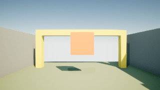
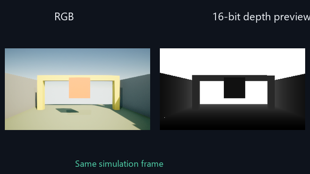
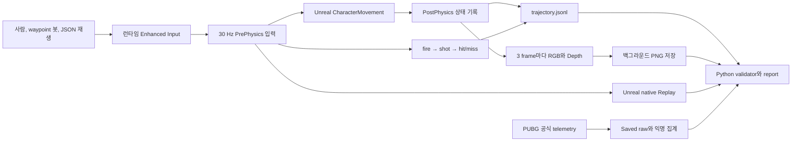

# Unreal SimTrace

Unreal SimTrace는 Unreal 플레이를 재현 가능한 AI 연구 데이터로 저장하고 검증하는 도구다. 이동 궤적뿐 아니라 한 번의 발사가 `fire → shot → hit/miss`로 이어지는 결과를 같은 simulation frame에 기록하고 JSON 입력 재생에서 사건 전체가 같은지 비교한다. Level, Blueprint, Input Action asset을 만들지 않고 `/Engine/Maps/Entry`에서 C++가 코스, 캐릭터, 입력, 조명, 센서와 사격장을 실행 시점에 생성한다.

현재 구현은 Unreal Engine 5.8.1 Editor Development 환경을 대상으로 한다.

## 구현 상태

자동화 가능한 범위는 구현과 검증을 완료했다. 아래 수치와 파일은 manifest에
기록된 런타임 revision `ff1b9a7bca35`, `8832e13d3ce4`, `70d27f71b60c`,
`4a349dc95d0f`에서 수집한 실제 실행 결과다. 최신 대표 sample은 전투 기능
커밋 `4a349dc95d0f`에서 다시 수집했다.

| 항목 | 현재 결과 |
|---|---:|
| 사람 플레이 수집 | 10회 모두 goal |
| 센서 포함 봇 수집 | 12회 모두 goal |
| 성능 기준 봇 수집 | 캡처 off 11회 |
| JSON 입력 재생 | 7회 |
| 유효 episode | 40 / 40 |
| RGB와 Depth 쌍 | 1,336쌍 |
| 누락 capture | 0 |
| capture drop | 0 |
| validator 오류와 경고 | 0 / 0 |
| JSON 재생 최대 평균 오차 | 0.000000 cm |
| JSON 재생 최대 p95 오차 | 0.000000 cm |
| 전투 원장 | 5발 5명중, replay 사건 일치 2 / 2 |
| 총 검증 데이터 크기 | 98,676,683 bytes, 약 94.11 MiB |
| 최신 전투 sample Git revision | `4a349dc95d0f` |

봇 캡처 on/off는 각각 1,980프레임과 1,815프레임을 비교했다.

| 측정 | Capture off | Capture on |
|---|---:|---:|
| 중앙 frame time | 36.136 ms | 34.211 ms |
| frame 수 | 1,815 | 1,980 |

계산된 median FPS drop은 -5.629%였다. 이 실행에서는 캡처로 인한 저하가
검출되지 않았으며, 음수 값은 서로 다른 실행 표본 사이의 변동으로 해석한다.

전체 `Saved/SimTrace` 데이터는 Git에서 제외하지만, 검증된 대표 episode와
보고서는 저장소의 [`docs/evidence`](docs/evidence)에 보존한다.

- [60초 실제 데이터 증거 영상](docs/evidence/simtrace_demo.mp4)
- [검증 보고서](docs/evidence/reports/summary.md)
- [실제 manifest](docs/evidence/sample/manifest.json)
- [실제 trajectory 발췌](docs/evidence/sample/trajectory_excerpt.jsonl)
- [16-bit Depth 원본](docs/evidence/sample/depth.png)
- [Unreal native Replay archive](docs/evidence/sample/native_replay.replay)
- [One Bullet Outcome Ledger 그래프](docs/evidence/reports/combat_ledger.png)





공개 보고서에는 bot 23회, 사람 플레이 10회, input-replay 7회가 모드별로
구분되어 있다. 대표 원본 샘플과 자동 증거 영상은 재현 가능한 bot episode를
사용하며, 사람 플레이 결과는 보고서와 행동 분포에 별도로 표시한다.

## 아키텍처



episode를 reset한 뒤에는 사람 입력을 잠근 상태로 PostPhysics 한 프레임을
warm-up하고, 그 다음 프레임부터 recorder와 native Replay를 함께 시작한다.
이 순서로 CharacterMovement의 바닥 정착이 끝난 상태를 `sim_frame = 0`으로 기록한다.

핵심 책임은 다음 파일에 나뉜다.

| 책임 | 파일 |
|---|---|
| 실행 옵션과 모드 | `SimTraceRuntimeConfig` |
| 결정적 코스 생성과 hash | `SimTraceCourseLayout`, `SimTraceCourseActor` |
| 런타임 입력과 1인칭 캐릭터 | `SimTraceCharacter`, `SimTracePlayerController` |
| episode 상태와 봇, 입력 재생 | `SimTraceGameMode` |
| 런타임 조준점과 사격 결과 HUD | `SimTraceHUD` |
| JSONL과 manifest | `EpisodeRecorderComponent` |
| RGB와 Depth, 비동기 PNG | `SimTraceCaptureComponent` |
| native Replay | `SimTraceGameInstance` |
| 데이터 검증과 보고서 집계 | `Scripts/validate_dataset.py` |
| Matplotlib 그래프 생성 | `Scripts/simtrace_plots.py` |
| PUBG telemetry 수집과 익명 집계 | `Scripts/pubg_telemetry.py` |
| 추적 가능한 샘플과 60초 증거 영상 | `Scripts/publish_evidence.py` |

## 요구 환경

- Unreal Engine 5.8.1
- Visual Studio의 Unreal C++ toolchain
- PowerShell 7 또는 Windows PowerShell
- `uv`
- Python 3.13
- `ffmpeg`, `ffprobe`는 증거 영상 갱신에만 필요

프로젝트 전용 `.uasset`은 필요하지 않다. Engine의 `/Engine/BasicShapes/Cube`와 기본 material만 런타임에 참조하고, 동적 material로 올리브, 콘크리트, 러스트 계열의 전장 훈련장 팔레트를 적용한다.

## 설치와 빌드

Python 환경을 만든다.

```powershell
uv sync --python 3.13
```

Editor Development target을 빌드한다.

```powershell
powershell -ExecutionPolicy Bypass -File Scripts/build.ps1
```

Unreal 설치 경로가 다르면 지정한다.

```powershell
powershell -ExecutionPolicy Bypass -File Scripts/build.ps1 `
  -EngineRoot "D:\Epic\UE_5.8"
```

Live Coding이 실행 중이면 외부 빌드가 차단될 수 있다. 이 경우 Unreal Editor와 Live Coding Console을 닫고 다시 실행한다.

## 실행

### 사람 플레이 10회

```powershell
powershell -ExecutionPolicy Bypass -File Scripts/run_simtrace.ps1 `
  -Mode human `
  -Seed 1000 `
  -BatchCount 10 `
  -Capture 1
```

조작법은 다음과 같다.

| 입력 | 동작 |
|---|---|
| W, A, S, D | 이동 |
| 마우스 | 시점 |
| 마우스 왼쪽 버튼 | hitscan 한 발 발사와 결과 기록 |
| Space | 점프 |
| R | 현재 episode를 manual_abort로 종료하고 다음 시드 시작 |
| Esc | 프로그램 종료 |

목표에 도착하면 다음 시드가 자동으로 시작된다. 실패 회차도 삭제하지 않고 종료 원인 통계에 포함한다.

### 봇 10회

```powershell
powershell -ExecutionPolicy Bypass -File Scripts/run_simtrace.ps1 `
  -Mode bot `
  -Seed 1000 `
  -BatchCount 10 `
  -Capture 1 `
  -Headless
```

봇은 NavMesh나 Behavior Tree 없이 정해진 waypoint와 전방 Ray Cast를 사용한다. 목표판을 조준해 한 발을 발사하며, 이동과 사격 입력 모두 사람과 같은 Enhanced Input action으로 주입한다.

### JSON 입력 재생

```powershell
$trajectory = Resolve-Path `
  "Saved\SimTrace\episodes\<source-episode>\trajectory.jsonl"

powershell -ExecutionPolicy Bypass -File Scripts/run_simtrace.ps1 `
  -Mode input-replay `
  -InputPath $trajectory `
  -Capture 0 `
  -Headless
```

재생은 원본 manifest의 seed, 시작 transform, 속도와 controller 회전을 사용한다. 원본의 마지막 action frame까지 실행하며 새 manifest에 `parent_episode_id`를 기록한다.

### Unreal native Replay

먼저 episode의 `manifest.json`에서 `replay_name`을 확인한다.

```powershell
powershell -ExecutionPolicy Bypass -File Scripts/run_simtrace.ps1 `
  -Mode native-replay `
  -ReplayName "simtrace_<episode-id>"
```

archive가 `Saved/Demos`에 없으면 `Saved/SimTrace/episodes`에서 찾아 복원한 뒤 Unreal Replay System으로 재생한다. 재생 종료 delegate가 호출되면 프로그램도 종료된다.

### 캡처 성능 기준

같은 시드로 캡처를 끈 봇 데이터를 만든다.

```powershell
powershell -ExecutionPolicy Bypass -File Scripts/run_simtrace.ps1 `
  -Mode bot `
  -Seed 1000 `
  -BatchCount 10 `
  -Capture 0 `
  -Headless
```

보고서는 bot mode의 capture on/off만 성능 비교에 사용한다.

### PUBG telemetry 가져오기

API key는 명령행 인자로 받지 않고 현재 PowerShell process의 환경변수로만 전달한다.

```powershell
$secureKey = Read-Host "PUBG API key" -AsSecureString
$env:PUBG_API_KEY = [Net.NetworkCredential]::new("", $secureKey).Password

uv run python Scripts/pubg_telemetry.py fetch `
  --platform steam `
  --player-name "<PUBG player name>"
```

match ID를 이미 알고 있으면 `--player-name` 대신 `--match-id "<match-id>"`를 사용한다. importer는 공식 match endpoint에서 관련 telemetry asset을 찾고 gzip JSON을 내려받는다. API 응답과 telemetry 원본, 원본 URL을 포함한 private provenance는 다음 경로에만 저장된다.

```text
Saved/SimTrace/imports/pubg/raw/<platform>/<match-id>/
```

계정 ID와 player name을 제외한 공격, 피해, knock, kill, 위치 표본과 phase 통계는 hash 기반 provenance와 함께 `Saved/SimTrace/imports/pubg/derived`에 저장된다. `LogPlayerKillV2`의 거리는 공식 `DamageInfo` 중 `finishDamageInfo`, `killerDamageInfo`, `dBNODamageInfo` 순서로 복원한다. 공개 저장소로 복사할 때는 top-level과 중첩 객체의 정확한 field 구성을 다시 검사하고, 검증된 값으로 새 summary를 만든다.

```powershell
uv run python Scripts/pubg_telemetry.py publish `
  "Saved/SimTrace/imports/pubg/derived/<platform>/<hash>/summary.json" `
  --output "docs/evidence/pubg/<match-hash>.json"
```

공개 summary에는 원본 match ID 대신 SHA-256만 남고 `raw_data_publishable=false`, `contains_player_identifiers=false`가 기록된다. API key는 어느 파일에도 쓰지 않는다. PUBG Developer API의 기본 key는 공식 문서 기준 분당 10회 제한이므로 batch crawler는 구현하지 않았다.

### 런타임 사격장 표현

화면은 PUBG의 야외 전투 훈련장 인상을 참고해 올리브색 바닥, 콘크리트 벽, 러스트색 엄폐물, 붉은 목표판, 중앙 조준점과 사격 결과 패널로 구성했다. 모든 geometry, material instance와 HUD는 C++가 실행 중 생성하므로 프로젝트 전용 asset 편집은 없다.

PUBG 로고, 원본 맵 배치, 추출한 model과 texture는 포함하지 않는다. 외부 소품을 더할 때는 [Poly Haven CC0](https://polyhaven.com/license) 또는 [Kenney CC0](https://kenney.nl/support) asset page, license, 원본 파일 SHA-256을 함께 보존한다. 현재 기본 실행은 외부 model 없이 같은 결과를 재현한다.

## 데이터 구조

```text
Saved/SimTrace/episodes/<episode_id>/
  manifest.json
  trajectory.jsonl
  rgb/
    000000.png
    000003.png
  depth/
    000000.png
    000003.png
  replay/
    simtrace_<episode_id>.replay
```

기록 중에는 `manifest.partial.json`만 존재한다. JSONL을 닫고 이미지 작업을 전부 기다린 뒤 native Replay archive와 파일 집계를 반영해 `manifest.json`으로 교체한다.

episode ID는 UTC millisecond 시각, mode, seed, batch 순번으로 구성한다.

```text
episode_20260730T130155085Z_bot_s1000_00
```

## Trajectory schema

한 줄은 30 Hz simulation frame 하나를 뜻한다.

```json
{
  "schema_version": 2,
  "sim_frame": 42,
  "timestamp_s": 1.4,
  "delta_s": 0.033333,
  "position_cm": [120.0, 35.0, 90.0],
  "rotation_deg": [0.0, 15.0, 0.0],
  "velocity_cm_s": [210.0, 0.0, 0.0],
  "goal_relative_cm": [2980.0, -35.0, 10.0],
  "move_input": [1.0, 0.0],
  "look_input": [0.15, -0.03],
  "jump_pressed": false,
  "fire_pressed": true,
  "combat_events": [
    {"sequence": 0, "event": "fire", "shot_id": 0},
    {
      "sequence": 1,
      "event": "shot",
      "shot_id": 0,
      "origin_cm": [120.0, 35.0, 154.0],
      "direction": [1.0, 0.0, 0.0]
    },
    {
      "sequence": 2,
      "event": "hit",
      "shot_id": 0,
      "target_id": "target_alpha",
      "impact_position_cm": [2930.0, 6.4, 168.0],
      "distance_cm": 2810.2
    }
  ],
  "collision": false,
  "captured": true,
  "rgb_path": "rgb/000042.png",
  "depth_path": "depth/000042.png",
  "capture_dropped": false,
  "frame_time_ms": 38.2,
  "done": false,
  "end_reason": ""
}
```

사격하지 않은 frame은 `fire_pressed=false`, `combat_events=[]`다. 발사 frame은 순서가 고정된 세 사건을 갖고 마지막 사건만 `hit` 또는 `miss`가 된다. `shot_id`는 episode 안에서 0부터 증가한다. manifest의 `combat_contract`, `shots_fired`, `shots_hit`, `shot_hit_rate`는 전체 JSONL 원장과 일치해야 한다. validator는 기존 schema 1 episode도 계속 읽지만 새 수집은 schema 2로 기록한다.

`timestamp_s`는 실제 경과 시간이 아니라 `sim_frame / 30`으로 계산한다. 마지막 행은 항상 `done=true`이며 다음 종료 원인 중 하나를 갖는다.

- `goal`
- `timeout`
- `fell`
- `manual_abort`
- `capture_error`
- `io_error`
- `replay_source_end`

## RGB와 Depth

| 센서 | 설정 |
|---|---|
| RGB | `SCS_FinalColorLDR`, 8-bit RGBA PNG |
| Depth | `SCS_SceneDepth`, R32 float readback |
| 저장 Depth | 16-bit grayscale PNG |
| 크기 | 320 x 180 |
| 주기 | 3 simulation frame마다, 10 Hz |
| 최대 거리 | 2000 cm |
| 비동기 queue | RGB와 Depth 8쌍 |

16-bit Depth 값 `v`는 다음처럼 복원한다.

```text
v == 0: 배경 또는 유효하지 않은 pixel
depth_cm = min(v / 65535.0 * 2000.0, 2000.0)
```

queue가 가득 차면 frame을 조용히 버리지 않고 `capture_dropped=true`로 기록한다. 최종 수집에서 drop이 한 건이라도 있으면 validator가 실패한다. 현재 구현에서는 Scene Depth fallback을 사용하지 않았으며 실제 16-bit PNG 경로가 동작한다.

## 검증과 보고서

전체 데이터 계약을 검사한다.

```powershell
uv run python Scripts/validate_dataset.py validate `
  Saved/SimTrace/episodes
```

원본과 JSON 입력 재생을 직접 비교한다.

```powershell
uv run python Scripts/validate_dataset.py compare `
  Saved/SimTrace/episodes/<original-episode> `
  Saved/SimTrace/episodes/<replayed-episode>
```

요약과 그래프를 생성한다.

```powershell
uv run python Scripts/validate_dataset.py report `
  Saved/SimTrace/episodes
```

출력은 `Saved/SimTrace/reports`에 생성된다.

- `summary.json`
- `summary.md`
- `episode_sizes.png`
- `episode_outcomes.png`
- `action_distributions.png`
- `combat_ledger.png`
- `replay_error.png`
- `capture_performance.png`

검증된 결과에서 저장소용 소형 증거 번들을 갱신한다.

```powershell
uv run python Scripts/publish_evidence.py
```

이 명령은 대표 manifest, trajectory 발췌, RGB와 16-bit Depth 원본,
native Replay archive, 보고서와 정확히 60초인 MP4를 `docs/evidence`에
생성한다. 영상은 실제 수집 RGB 프레임과 실제 보고서만 사용하며 `ffprobe`로
길이를 검사한다.

validator는 다음을 실패로 처리한다.

- partial manifest 또는 완료 flag 오류
- 필수 provenance와 센서 계약 누락
- sim frame 중복, 역순, 누락
- 30 Hz timestamp 불일치
- RGB와 Depth pair 누락
- 잘못된 크기, bit depth, PNG color type
- orphan 이미지
- capture drop
- 마지막 `done=true` 누락
- manifest와 실제 frame, 파일 수, byte 수 불일치
- native Replay archive 누락
- JSON 재생의 잘못된 부모 또는 frame 정렬
- `fire → shot → hit/miss` 사건 순서, shot ID 또는 manifest 집계 불일치
- JSON 재생의 사격 action과 outcome 원장 불일치

## 테스트

Python 단위 테스트를 실행한다.

```powershell
uv run python -m unittest discover -s Scripts/tests -t .
```

Unreal Automation Tests를 실행한다.

```powershell
& "C:\Program Files\Epic Games\UE_5.8\Engine\Binaries\Win64\UnrealEditor-Cmd.exe" `
  "$PWD\UnrealSimTrace.uproject" `
  -unattended `
  -NullRHI `
  -NoSound `
  -nosplash `
  '-ExecCmds=Automation RunTests SimTrace.Core;Quit' `
  '-TestExit=Automation Test Queue Empty'
```

테스트 범위는 다음과 같다.

- 같은 seed의 course hash, 시작과 목표 일치
- 다른 seed의 코스 변화
- trajectory JSON 직렬화
- 런타임 fire mapping, HUD class와 사격 원장 직렬화
- 30 Hz timestamp
- 실행 옵션 parsing과 안전한 clamp
- Depth uint16 변환과 saturation
- episode 데이터 계약
- RGB와 Depth 누락 감지
- total byte 교차 검사
- manifest total byte 자릿수 경계 수렴
- JSON 재생 부모와 전체 frame 정렬
- JSON 재생의 exact combat event 비교
- PUBG telemetry gzip, 공식 CDN, KillV2 거리, 익명 집계와 재귀 공개 whitelist
- 상수에 가까운 행동값의 report 생성
- 성능 비교에서 bot capture on/off만 선택

## 60초 증거 영상

[`docs/evidence/simtrace_demo.mp4`](docs/evidence/simtrace_demo.mp4)는
`Scripts/publish_evidence.py`가 실제 수집 결과에서 생성한다.

| 시간 | 화면 |
|---|---|
| 0초에서 5초 | 프로젝트와 측정 commit |
| 5초에서 45초 | C++ 런타임 코스의 실제 봇 RGB |
| 45초에서 50초 | 같은 sim frame의 RGB와 16-bit Depth |
| 50초에서 55초 | JSON 입력 재생 위치 오차 |
| 55초에서 60초 | 유효 episode, drop과 replay 결과 |

현재 저장된 MP4는 재현 가능한 자동 증거 영상이다. 면접용 라이브 화면에서는
사람 조작 실행을 별도로 녹화하고 자동 증거 영상과 구분해 표시한다.

## 공식 API 기준

- [Enhanced Input](https://dev.epicgames.com/documentation/unreal-engine/enhanced-input-in-unreal-engine)
- [SceneCaptureComponent2D](https://dev.epicgames.com/documentation/en-us/unreal-engine/API/Runtime/Engine/USceneCaptureComponent2D)
- [Replay System](https://dev.epicgames.com/documentation/en-us/unreal-engine/using-the-replay-system-in-unreal-engine)
- [Automation Tests](https://dev.epicgames.com/documentation/unreal-engine/run-automation-tests-in-unreal-engine)
- [PUBG Telemetry](https://documentation.pubg.com/en/telemetry.html)
- [PUBG Telemetry Events](https://documentation.pubg.com/en/telemetry-events.html)
- [PUBG API Keys](https://documentation.pubg.com/en/api-keys.html)
- [PUBG API Terms](https://developer.pubg.com/tos?locale=en)
