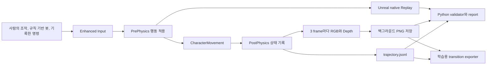

# Unreal SimTrace

플레이어의 입력과 게임 상태, 그 순간의 화면과 공간 정보를 함께 기록하고, 같은 입력을 다시 실행했을 때 결과가 재현되는지 확인하는 Unreal Engine 5 실험 환경입니다.

`Unreal Engine 5.8.1` `C++` `Python` `개인 프로젝트`

[60초 실행 및 검증 영상](docs/evidence/simtrace_demo.mp4) | [검증 보고서](docs/evidence/reports/summary.md) | [대표 manifest](docs/evidence/sample/manifest.json) | [trajectory 발췌](docs/evidence/sample/trajectory_excerpt.jsonl)


## 프로젝트를 시작한 이유

게임 화면만 녹화해 두면 그 순간 어떤 입력이 들어왔고, 물리 계산이 끝난 뒤 캐릭터가 어떤 상태가 되었는지 다시 알기 어렵습니다. 사람과 봇이 서로 다른 방식으로 캐릭터를 움직인다면 결과의 차이가 행동 때문인지 구현 차이 때문인지도 구분하기 어렵습니다.

소형 GPT를 직접 구현하며 모델 구조뿐 아니라 입력과 정답이 어떻게 연결된 데이터를 주는지가 중요하다는 점을 배웠습니다. 이 경험을 게임 엔진 안에서도 확인해 보고 싶어, 모델 학습보다 먼저 행동과 상태, 센서 데이터를 언제 어떻게 기록하고 검증할지에 집중했습니다.

## 한눈에 보기

| 항목 | 내용 |
|---|---|
| 개발 형태 | 개인 개발 |
| 핵심 질문 | 같은 게임 상황을 반복해서 비교할 수 있는 데이터를 어떻게 만들 것인가 |
| 수집 대상 | 이동과 시점 입력, 캐릭터 상태, 충돌과 사격 이벤트, RGB, 16비트 Depth |
| 입력 방식 | 사람 조작, 규칙 기반 봇, 기록한 입력을 다시 적용하는 실행 |
| 결과물 | Unreal 수집 환경, 입력 재실행, Python 검증 도구, 보고서와 학습용 인덱스 exporter |
| 구현 범위 | 데이터 생성과 검증까지이며 모델 학습은 포함하지 않음 |

Level, Blueprint, Input Action asset을 따로 만들지 않았습니다. `/Engine/Maps/Entry`에서 C++가 seed 기반 코스, 캐릭터, 입력, 조명, 센서와 사격장을 실행 시점에 생성합니다. 프로젝트 전용 asset 없이도 같은 조건을 다시 만들 수 있게 하기 위한 선택입니다.

## 처음 만난 문제

초기 구현에서는 사람이 직접 조작할 때, 봇이 자동으로 움직일 때, 저장한 이동 명령을 다시 실행할 때가 각각 다른 코드 경로를 사용했습니다. 같은 명령이어도 적용되는 시점이 달라졌고, 저장한 입력을 다시 실행하면 원본과 이동 경로와 최종 위치가 달라졌습니다.

단순히 좌표를 더 자주 저장하는 것으로는 이 문제를 해결할 수 없었습니다. 어떤 입력을 어느 시점에 적용했고, 물리 계산이 끝난 뒤 어떤 상태가 되었는지를 같은 기준으로 기록해야 했습니다.

## 어떻게 해결했나

### 입력 경로를 하나로 통합

사람의 조작, 규칙 기반 봇, 기록한 명령으로 다시 움직이는 경우가 모두 Unreal의 Enhanced Input을 거치도록 통합했습니다. 봇도 캐릭터 위치를 직접 바꾸지 않고 사람이 누르는 것과 같은 Move, Look, Jump, Fire action을 주입합니다.

이동 명령은 PrePhysics에 적용하고, 그 결과는 CharacterMovement의 물리 계산이 끝난 PostPhysics 시점에 기록합니다. 입력 방식이 달라도 행동이 적용되고 상태가 저장되는 순서는 같아집니다.

### 행동과 상태, 센서를 같은 시간축에 기록

행동과 상태, 이벤트는 초당 30번 기록합니다. RGB와 16비트 Depth는 초당 10번 저장하고 같은 `sim_frame` 번호로 묶습니다. 이미지 저장은 백그라운드 작업으로 넘기되, queue가 가득 차면 조용히 버리지 않고 `capture_dropped=true`를 남깁니다.

한 episode에는 다음 정보가 함께 저장됩니다.

| 주기 | 기록 내용 |
|---|---|
| 30 Hz | 이동과 시점 입력, 위치, 회전, 속도, 목표까지의 상대 좌표, 충돌과 사격 이벤트 |
| 10 Hz | 같은 simulation frame의 320 x 180 RGB와 16비트 Depth |
| episode 단위 | seed, 실행 모드, Engine과 Git revision, 종료 이유, 파일 수와 크기, Replay 정보 |

### 수집 결과를 다시 검증

기록 도중 프로그램이 종료된 데이터를 완성된 episode로 오인하지 않도록 먼저 `manifest.partial.json`을 만듭니다. JSONL과 이미지 저장이 모두 끝나고 파일 수까지 확인한 뒤에만 `manifest.json`으로 교체합니다.

Python validator는 프레임 중복과 누락, 30 Hz timestamp, RGB와 Depth 대응 관계, 이미지 bit depth, capture drop, 종료 상태, manifest와 실제 파일 수를 검사합니다. 저장한 입력을 다시 실행한 결과도 원본 trajectory와 프레임별로 비교합니다.

## 데이터 흐름



episode를 reset한 직후에는 사람 입력을 잠그고 PostPhysics 한 프레임을 기다립니다. CharacterMovement가 바닥에 정착한 다음 프레임을 `sim_frame = 0`으로 삼아 recorder와 native Replay를 함께 시작합니다.

## 검증 결과

아래 수치는 저장소에 포함된 [실제 검증 보고서](docs/evidence/reports/summary.md)와 manifest에서 다시 확인할 수 있습니다.

| 항목 | 결과 |
|---|---:|
| 유효 episode | 60 / 60 |
| 사람 플레이 | 10회 모두 goal |
| 봇 실행 | 43회 모두 goal |
| 기록한 입력으로 다시 실행 | 7회 |
| RGB와 Depth 쌍 | 1,886쌍 |
| 누락 capture | 0 |
| capture drop | 0 |
| validator 오류와 경고 | 0 / 0 |
| 원본과 다시 실행한 경로 | 7 / 7 exact |
| Python 회귀 테스트 | 60개 통과 |
| Unreal Automation | 7개 통과 |

7개 경로는 같은 Unreal Engine 버전과 같은 Git revision으로 만든 원본과 다시 실행한 결과를 비교했고, 프레임별 위치와 최종 위치가 모두 일치했습니다. 다른 PC에서도 같은 결과가 나오는지는 아직 검증하지 않았습니다.

캡처 성능은 같은 코스 seed 10쌍에서 capture off와 on의 실행 순서를 번갈아 측정했습니다. 대응 p95 frame time 차이의 중앙값은 0.0888 ms였고 bootstrap 95% 구간은 0.0223 ms에서 0.3408 ms였습니다. 평균 FPS로 바꾸지 않고, 프레임이 느려지는 구간에서 관측된 추가 지연으로만 기록했습니다.

## 데이터 구조

```text
Saved/SimTrace/episodes/<episode_id>/
  manifest.json
  trajectory.jsonl
  rgb/
    000000.png
    000003.png
  depth/
    000000.png
    000003.png
  replay/
    simtrace_<episode-id>.replay
```

trajectory 한 줄은 30 Hz simulation frame 하나를 뜻합니다.

```json
{
  "sim_frame": 42,
  "timestamp_s": 1.4,
  "position_cm": [120.0, 35.0, 90.0],
  "velocity_cm_s": [210.0, 0.0, 0.0],
  "goal_relative_cm": [2980.0, -35.0, 10.0],
  "move_input": [1.0, 0.0],
  "look_input": [0.15, -0.03],
  "jump_pressed": false,
  "captured": true,
  "rgb_path": "rgb/000042.png",
  "depth_path": "depth/000042.png",
  "done": false
}
```

Depth는 `SCS_SceneDepth`의 R32 float 값을 읽어 최대 2000 cm 범위의 16비트 grayscale PNG로 저장합니다. 값이 0이면 배경 또는 유효하지 않은 pixel이며, 나머지는 다음 식으로 cm 단위 거리를 복원합니다.

```text
depth_cm = min(v / 65535.0 * 2000.0, 2000.0)
```

## 더 확장해 본 부분

핵심 수집과 재실행을 만든 뒤, 이 데이터가 실제로 어디까지 이어질 수 있는지도 작은 기능으로 확인했습니다.

### 사격 행동과 결과 연결

한 번의 발사를 `fire -> shot -> hit 또는 miss` 순서의 사건으로 기록하고 같은 `shot_id`로 묶었습니다. 25개 발사 결과를 기록했고, 사격 입력을 다시 적용한 2건에서는 사건 순서와 결과까지 일치했습니다.

### 학습용 데이터 인덱스

모델을 학습하지는 않았지만 수집 결과를 그대로 넘기는 대신, frame `t`의 관측과 frame `t+1`에 적용한 행동, 그 결과인 frame `t+1` 상태를 하나의 transition으로 내보내는 exporter를 만들었습니다. 같은 코스가 train과 validation, test에 동시에 들어가지 않도록 course seed 단위로 나눕니다.

현재 공개 manifest 기준으로 사람과 봇 53개 episode에서 8,895개 transition과 RGB와 Depth를 포함한 표본 1,827개를 만들었습니다. 기록한 입력을 다시 적용한 데이터는 원본 행동을 복제한 검증 자료이므로 기본 학습 인덱스에서 제외합니다.

### 실제 게임 플레이 로그 구조 확인

별도 실험으로 PUBG 공식 API의 telemetry를 내려받아 공격, 피해, knock, kill, 위치와 phase 정보를 익명 집계로 변환했습니다. API key와 원본 match ID, 사용자 식별자는 공개 파일에 남기지 않고 원본을 추적할 수 있는 hash만 보존합니다. 이 기능은 SimTrace 핵심 파이프라인과 분리되어 있으며, 실제 게임 데이터의 사건 구조를 살펴보기 위한 확장입니다.

## 프로젝트 구조

| 책임 | 파일 |
|---|---|
| 실행 옵션과 모드 | `SimTraceRuntimeConfig` |
| seed 기반 코스 생성 | `SimTraceCourseLayout`, `SimTraceCourseActor` |
| 입력과 1인칭 캐릭터 | `SimTraceCharacter`, `SimTracePlayerController` |
| episode와 봇, 기록한 명령으로 다시 실행 | `SimTraceGameMode` |
| 사격 결과 HUD | `SimTraceHUD` |
| JSONL과 manifest | `EpisodeRecorderComponent` |
| RGB와 Depth, 비동기 PNG 저장 | `SimTraceCaptureComponent` |
| native Replay | `SimTraceGameInstance` |
| 데이터 검증과 보고서 | `Scripts/validate_dataset.py` |
| 학습용 transition export | `Scripts/export_ml_dataset.py` |
| 캡처 성능 측정 | `Scripts/run_capture_benchmark.ps1` |
| PUBG telemetry 변환 | `Scripts/pubg_telemetry.py` |
| 공개 evidence 생성 | `Scripts/publish_evidence.py` |

## 실행 방법

### 요구 환경

- Unreal Engine 5.8.1
- Visual Studio Unreal C++ toolchain
- PowerShell 7 또는 Windows PowerShell
- Python 3.13과 `uv`
- `ffmpeg`, `ffprobe`는 증거 영상을 다시 만들 때만 필요

Python 환경을 만들고 Editor Development target을 빌드합니다.

```powershell
uv sync --python 3.13
powershell -ExecutionPolicy Bypass -File Scripts/build.ps1
```

Unreal 설치 위치가 다르면 `-EngineRoot`로 지정할 수 있습니다.

```powershell
powershell -ExecutionPolicy Bypass -File Scripts/build.ps1 `
  -EngineRoot "D:\Epic\UE_5.8"
```

봇 수집을 한 번 실행하는 가장 짧은 명령은 다음과 같습니다.

```powershell
powershell -ExecutionPolicy Bypass -File Scripts/run_simtrace.ps1 `
  -Mode bot `
  -Seed 1000 `
  -BatchCount 1 `
  -Capture 1 `
  -Headless
```

<details>
<summary>사람 플레이와 기록한 입력으로 다시 실행</summary>

사람 플레이를 실행합니다.

```powershell
powershell -ExecutionPolicy Bypass -File Scripts/run_simtrace.ps1 `
  -Mode human `
  -Seed 1000 `
  -BatchCount 10 `
  -Capture 1
```

| 입력 | 동작 |
|---|---|
| W, A, S, D | 이동 |
| 마우스 | 시점 |
| 마우스 왼쪽 버튼 | hitscan 한 발 발사 |
| Space | 점프 |
| R | 현재 episode 종료 후 다음 seed 시작 |
| Esc | 프로그램 종료 |

기록한 입력을 같은 환경에 다시 적용합니다.

```powershell
$trajectory = Resolve-Path `
  "Saved\SimTrace\episodes\<source-episode>\trajectory.jsonl"

powershell -ExecutionPolicy Bypass -File Scripts/run_simtrace.ps1 `
  -Mode input-replay `
  -InputPath $trajectory `
  -Capture 0 `
  -Headless
```

</details>

<details>
<summary>native Replay와 캡처 성능 측정</summary>

manifest의 `replay_name`으로 Unreal native Replay를 실행합니다.

```powershell
powershell -ExecutionPolicy Bypass -File Scripts/run_simtrace.ps1 `
  -Mode native-replay `
  -ReplayName "simtrace_<episode-id>"
```

같은 seed의 capture off와 on을 한 쌍으로 만들고 순서를 교차해 실행합니다.

```powershell
powershell -ExecutionPolicy Bypass `
  -File Scripts/run_capture_benchmark.ps1 `
  -PairCount 10 `
  -StartSeed 6000
```

</details>

## 검증과 테스트

전체 데이터 계약을 검사하고 원본과 다시 실행한 결과를 비교합니다.

```powershell
uv run python Scripts/validate_dataset.py validate `
  Saved/SimTrace/episodes

uv run python Scripts/validate_dataset.py compare `
  Saved/SimTrace/episodes/<original-episode> `
  Saved/SimTrace/episodes/<replayed-episode>

uv run python Scripts/validate_dataset.py report `
  Saved/SimTrace/episodes
```

Python 회귀 테스트를 실행합니다.

```powershell
uv run python -m unittest discover -s Scripts/tests -t .
```

Unreal Automation Tests를 실행합니다.

```powershell
& "C:\Program Files\Epic Games\UE_5.8\Engine\Binaries\Win64\UnrealEditor-Cmd.exe" `
  "$PWD\UnrealSimTrace.uproject" `
  -unattended `
  -NullRHI `
  -NoSound `
  -nosplash `
  '-ExecCmds=Automation RunTests SimTrace.Core;Quit' `
  '-TestExit=Automation Test Queue Empty'
```

## 공개 검증 자료

전체 `Saved/SimTrace` 데이터는 용량과 개인 로컬 경로 때문에 Git에서 제외했습니다. 대신 validator를 통과한 대표 episode와 보고서, 원본 파일의 hash를 [`docs/evidence`](docs/evidence)에 보존합니다. 공개 표본은 Git revision `ad1c6bff321f`에서 수집했습니다.

- [60초 실제 데이터 증거 영상](docs/evidence/simtrace_demo.mp4)
- [검증 결과 전체](docs/evidence/reports/summary.md)
- [대표 RGB 원본](docs/evidence/sample/rgb.png)
- [16비트 Depth 원본](docs/evidence/sample/depth.png)
- [Unreal native Replay archive](docs/evidence/sample/native_replay.replay)
- [학습용 데이터 요약](docs/evidence/ml_dataset_manifest.json)
- [익명 PUBG telemetry 집계](docs/evidence/pubg/0340a0db4df30089.json)

## 현재 범위와 한계

- 데이터 생성, 재실행과 검증을 다루며 강화학습이나 모델 학습은 구현하지 않았습니다.
- 봇은 학습된 AI가 아니라 waypoint와 전방 Ray Cast를 사용하는 규칙 기반 봇입니다.
- exact 경로 일치는 같은 Engine 버전과 Git revision에서 검증한 결과이며, 다른 PC 사이의 결정성은 아직 확인하지 않았습니다.
- 환경은 데이터 흐름을 검증하기 위한 단순한 사격장입니다. 실제 게임 수준의 복잡한 맵과 물리 상호작용은 다루지 않았습니다.
- 전체 수집 데이터 대신 재현 가능한 대표 표본과 검증 보고서만 저장소에 공개했습니다.

## 참고한 공식 문서

- [Enhanced Input](https://dev.epicgames.com/documentation/unreal-engine/enhanced-input-in-unreal-engine)
- [SceneCaptureComponent2D](https://dev.epicgames.com/documentation/en-us/unreal-engine/API/Runtime/Engine/USceneCaptureComponent2D)
- [Replay System](https://dev.epicgames.com/documentation/en-us/unreal-engine/using-the-replay-system-in-unreal-engine)
- [Automation Tests](https://dev.epicgames.com/documentation/unreal-engine/run-automation-tests-in-unreal-engine)
- [PUBG Telemetry](https://documentation.pubg.com/en/telemetry.html)
- [PUBG API Terms](https://developer.pubg.com/tos?locale=en)
