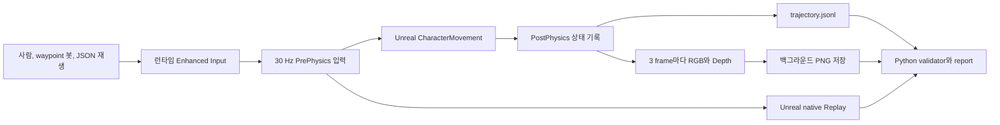

# Unreal SimTrace

Unreal SimTrace는 Unreal 플레이를 재현 가능한 AI 연구 데이터로 저장하고 검증하는 도구다. Level, Blueprint, Input Action asset을 만들지 않고 `/Engine/Maps/Entry`에서 C++가 코스, 캐릭터, 입력, 조명, 센서를 실행 시점에 생성한다.

현재 구현은 Unreal Engine 5.8.1 Editor Development 환경을 대상으로 한다.

## 구현 상태

자동화 가능한 범위는 구현과 검증을 완료했다. 아래 수치와 파일은
`ff1b9a7bca35`에서 새로 수집한 실제 실행 결과다.

| 항목 | 현재 결과 |
|---|---:|
| 센서 포함 봇 수집 | 10회 모두 goal |
| 성능 기준 봇 수집 | 캡처 off 10회 |
| JSON 입력 재생 | 3회 |
| 유효 episode | 23 / 23 |
| RGB와 Depth 쌍 | 550쌍 |
| 누락 capture | 0 |
| capture drop | 0 |
| validator 오류와 경고 | 0 / 0 |
| JSON 재생 최대 평균 오차 | 0.000000 cm |
| JSON 재생 최대 p95 오차 | 0.000000 cm |
| 총 검증 데이터 크기 | 39,678,350 bytes, 약 37.84 MiB |
| 측정 Git revision | `ff1b9a7bca35` |

봇 캡처 on/off는 각각 1,650프레임을 비교했다.

| 측정 | Capture off | Capture on |
|---|---:|---:|
| 중앙 frame time | 36.619 ms | 36.105 ms |
| frame 수 | 1,650 | 1,650 |

계산된 median FPS drop은 -1.422%였다. 이 실행에서는 캡처로 인한 저하가 검출되지 않았으며, 작은 음수 값은 실행 간 변동 범위로 해석한다.

전체 `Saved/SimTrace` 데이터는 Git에서 제외하지만, 검증된 대표 episode와
보고서는 저장소의 [`docs/evidence`](docs/evidence)에 보존한다.

- [60초 실제 데이터 증거 영상](docs/evidence/simtrace_demo.mp4)
- [검증 보고서](docs/evidence/reports/summary.md)
- [실제 manifest](docs/evidence/sample/manifest.json)
- [실제 trajectory 발췌](docs/evidence/sample/trajectory_excerpt.jsonl)
- [16-bit Depth 원본](docs/evidence/sample/depth.png)
- [Unreal native Replay archive](docs/evidence/sample/native_replay.replay)


공개 증거에는 자동 생성한 bot, capture baseline, input-replay episode만 포함한다.
사람 플레이 10회는 자동 데이터로 가장하지 않으며 실제 사용자가 아래 명령으로
수집해야 한다.

## 아키텍처



episode를 reset한 뒤에는 사람 입력을 잠근 상태로 PostPhysics 한 프레임을
warm-up하고, 그 다음 프레임부터 recorder와 native Replay를 함께 시작한다.
이 순서로 CharacterMovement의 바닥 정착이 끝난 상태를 `sim_frame = 0`으로 기록한다.

핵심 책임은 다음 파일에 나뉜다.

| 책임 | 파일 |
|---|---|
| 실행 옵션과 모드 | `SimTraceRuntimeConfig` |
| 결정적 코스 생성과 hash | `SimTraceCourseLayout`, `SimTraceCourseActor` |
| 런타임 입력과 1인칭 캐릭터 | `SimTraceCharacter`, `SimTracePlayerController` |
| episode 상태와 봇, 입력 재생 | `SimTraceGameMode` |
| JSONL과 manifest | `EpisodeRecorderComponent` |
| RGB와 Depth, 비동기 PNG | `SimTraceCaptureComponent` |
| native Replay | `SimTraceGameInstance` |
| 데이터 검증과 보고서 집계 | `Scripts/validate_dataset.py` |
| Matplotlib 그래프 생성 | `Scripts/simtrace_plots.py` |
| 추적 가능한 샘플과 60초 증거 영상 | `Scripts/publish_evidence.py` |

## 요구 환경

- Unreal Engine 5.8.1
- Visual Studio의 Unreal C++ toolchain
- PowerShell 7 또는 Windows PowerShell
- `uv`
- Python 3.13
- `ffmpeg`, `ffprobe`는 증거 영상 갱신에만 필요

프로젝트 전용 `.uasset`은 필요하지 않다. Engine의 `/Engine/BasicShapes/Cube`만 런타임에 참조한다.

## 설치와 빌드

Python 환경을 만든다.

```powershell
uv sync --python 3.13
```

Editor Development target을 빌드한다.

```powershell
powershell -ExecutionPolicy Bypass -File Scripts/build.ps1
```

Unreal 설치 경로가 다르면 지정한다.

```powershell
powershell -ExecutionPolicy Bypass -File Scripts/build.ps1 `
  -EngineRoot "D:\Epic\UE_5.8"
```

Live Coding이 실행 중이면 외부 빌드가 차단될 수 있다. 이 경우 Unreal Editor와 Live Coding Console을 닫고 다시 실행한다.

## 실행

### 사람 플레이 10회

```powershell
powershell -ExecutionPolicy Bypass -File Scripts/run_simtrace.ps1 `
  -Mode human `
  -Seed 1000 `
  -BatchCount 10 `
  -Capture 1
```

조작법은 다음과 같다.

| 입력 | 동작 |
|---|---|
| W, A, S, D | 이동 |
| 마우스 | 시점 |
| Space | 점프 |
| R | 현재 episode를 manual_abort로 종료하고 다음 시드 시작 |
| Esc | 프로그램 종료 |

목표에 도착하면 다음 시드가 자동으로 시작된다. 실패 회차도 삭제하지 않고 종료 원인 통계에 포함한다.

### 봇 10회

```powershell
powershell -ExecutionPolicy Bypass -File Scripts/run_simtrace.ps1 `
  -Mode bot `
  -Seed 1000 `
  -BatchCount 10 `
  -Capture 1 `
  -Headless
```

봇은 NavMesh나 Behavior Tree 없이 정해진 waypoint와 전방 Ray Cast를 사용한다. 봇 입력도 사람과 같은 Enhanced Input action으로 주입된다.

### JSON 입력 재생

```powershell
$trajectory = Resolve-Path `
  "Saved\SimTrace\episodes\<source-episode>\trajectory.jsonl"

powershell -ExecutionPolicy Bypass -File Scripts/run_simtrace.ps1 `
  -Mode input-replay `
  -InputPath $trajectory `
  -Capture 0 `
  -Headless
```

재생은 원본 manifest의 seed, 시작 transform, 속도와 controller 회전을 사용한다. 원본의 마지막 action frame까지 실행하며 새 manifest에 `parent_episode_id`를 기록한다.

### Unreal native Replay

먼저 episode의 `manifest.json`에서 `replay_name`을 확인한다.

```powershell
powershell -ExecutionPolicy Bypass -File Scripts/run_simtrace.ps1 `
  -Mode native-replay `
  -ReplayName "simtrace_<episode-id>"
```

archive가 `Saved/Demos`에 없으면 `Saved/SimTrace/episodes`에서 찾아 복원한 뒤 Unreal Replay System으로 재생한다. 재생 종료 delegate가 호출되면 프로그램도 종료된다.

### 캡처 성능 기준

같은 시드로 캡처를 끈 봇 데이터를 만든다.

```powershell
powershell -ExecutionPolicy Bypass -File Scripts/run_simtrace.ps1 `
  -Mode bot `
  -Seed 1000 `
  -BatchCount 10 `
  -Capture 0 `
  -Headless
```

보고서는 bot mode의 capture on/off만 성능 비교에 사용한다.

## 데이터 구조

```text
Saved/SimTrace/episodes/<episode_id>/
  manifest.json
  trajectory.jsonl
  rgb/
    000000.png
    000003.png
  depth/
    000000.png
    000003.png
  replay/
    simtrace_<episode_id>.replay
```

기록 중에는 `manifest.partial.json`만 존재한다. JSONL을 닫고 이미지 작업을 전부 기다린 뒤 native Replay archive와 파일 집계를 반영해 `manifest.json`으로 교체한다.

episode ID는 UTC millisecond 시각, mode, seed, batch 순번으로 구성한다.

```text
episode_20260730T130155085Z_bot_s1000_00
```

## Trajectory schema

한 줄은 30 Hz simulation frame 하나를 뜻한다.

```json
{
  "schema_version": 1,
  "sim_frame": 42,
  "timestamp_s": 1.4,
  "delta_s": 0.033333,
  "position_cm": [120.0, 35.0, 90.0],
  "rotation_deg": [0.0, 15.0, 0.0],
  "velocity_cm_s": [210.0, 0.0, 0.0],
  "goal_relative_cm": [2980.0, -35.0, 10.0],
  "move_input": [1.0, 0.0],
  "look_input": [0.15, -0.03],
  "jump_pressed": false,
  "collision": false,
  "captured": true,
  "rgb_path": "rgb/000042.png",
  "depth_path": "depth/000042.png",
  "capture_dropped": false,
  "frame_time_ms": 38.2,
  "done": false,
  "end_reason": ""
}
```

`timestamp_s`는 실제 경과 시간이 아니라 `sim_frame / 30`으로 계산한다. 마지막 행은 항상 `done=true`이며 다음 종료 원인 중 하나를 갖는다.

- `goal`
- `timeout`
- `fell`
- `manual_abort`
- `capture_error`
- `io_error`
- `replay_source_end`

## RGB와 Depth

| 센서 | 설정 |
|---|---|
| RGB | `SCS_FinalColorLDR`, 8-bit RGBA PNG |
| Depth | `SCS_SceneDepth`, R32 float readback |
| 저장 Depth | 16-bit grayscale PNG |
| 크기 | 320 x 180 |
| 주기 | 3 simulation frame마다, 10 Hz |
| 최대 거리 | 2000 cm |
| 비동기 queue | RGB와 Depth 8쌍 |

16-bit Depth 값 `v`는 다음처럼 복원한다.

```text
v == 0: 배경 또는 유효하지 않은 pixel
depth_cm = min(v / 65535.0 * 2000.0, 2000.0)
```

queue가 가득 차면 frame을 조용히 버리지 않고 `capture_dropped=true`로 기록한다. 최종 수집에서 drop이 한 건이라도 있으면 validator가 실패한다. 현재 구현에서는 Scene Depth fallback을 사용하지 않았으며 실제 16-bit PNG 경로가 동작한다.

## 검증과 보고서

전체 데이터 계약을 검사한다.

```powershell
uv run python Scripts/validate_dataset.py validate `
  Saved/SimTrace/episodes
```

원본과 JSON 입력 재생을 직접 비교한다.

```powershell
uv run python Scripts/validate_dataset.py compare `
  Saved/SimTrace/episodes/<original-episode> `
  Saved/SimTrace/episodes/<replayed-episode>
```

요약과 그래프를 생성한다.

```powershell
uv run python Scripts/validate_dataset.py report `
  Saved/SimTrace/episodes
```

출력은 `Saved/SimTrace/reports`에 생성된다.

- `summary.json`
- `summary.md`
- `episode_sizes.png`
- `episode_outcomes.png`
- `action_distributions.png`
- `replay_error.png`
- `capture_performance.png`

검증된 결과에서 저장소용 소형 증거 번들을 갱신한다.

```powershell
uv run python Scripts/publish_evidence.py
```

이 명령은 대표 manifest, trajectory 발췌, RGB와 16-bit Depth 원본,
native Replay archive, 보고서와 정확히 60초인 MP4를 `docs/evidence`에
생성한다. 영상은 실제 수집 RGB 프레임과 실제 보고서만 사용하며 `ffprobe`로
길이를 검사한다.

validator는 다음을 실패로 처리한다.

- partial manifest 또는 완료 flag 오류
- 필수 provenance와 센서 계약 누락
- sim frame 중복, 역순, 누락
- 30 Hz timestamp 불일치
- RGB와 Depth pair 누락
- 잘못된 크기, bit depth, PNG color type
- orphan 이미지
- capture drop
- 마지막 `done=true` 누락
- manifest와 실제 frame, 파일 수, byte 수 불일치
- native Replay archive 누락
- JSON 재생의 잘못된 부모 또는 frame 정렬

## 테스트

Python 단위 테스트를 실행한다.

```powershell
uv run python -m unittest discover -s Scripts/tests -t .
```

Unreal Automation Tests를 실행한다.

```powershell
& "C:\Program Files\Epic Games\UE_5.8\Engine\Binaries\Win64\UnrealEditor-Cmd.exe" `
  "$PWD\UnrealSimTrace.uproject" `
  -unattended `
  -NullRHI `
  -NoSound `
  -nosplash `
  '-ExecCmds=Automation RunTests SimTrace.Core;Quit' `
  '-TestExit=Automation Test Queue Empty'
```

테스트 범위는 다음과 같다.

- 같은 seed의 course hash, 시작과 목표 일치
- 다른 seed의 코스 변화
- trajectory JSON 직렬화
- 30 Hz timestamp
- 실행 옵션 parsing과 안전한 clamp
- Depth uint16 변환과 saturation
- episode 데이터 계약
- RGB와 Depth 누락 감지
- total byte 교차 검사
- JSON 재생 부모와 전체 frame 정렬
- 상수에 가까운 행동값의 report 생성
- 성능 비교에서 bot capture on/off만 선택

## 60초 증거 영상

[`docs/evidence/simtrace_demo.mp4`](docs/evidence/simtrace_demo.mp4)는
`Scripts/publish_evidence.py`가 실제 수집 결과에서 생성한다.

| 시간 | 화면 |
|---|---|
| 0초에서 5초 | 프로젝트와 측정 commit |
| 5초에서 45초 | C++ 런타임 코스의 실제 봇 RGB |
| 45초에서 50초 | 같은 sim frame의 RGB와 16-bit Depth |
| 50초에서 55초 | JSON 입력 재생 위치 오차 |
| 55초에서 60초 | 유효 episode, drop과 replay 결과 |

면접용 라이브 화면 녹화가 필요하면 사람 10회 수집을 마치고 report와
publish 명령을 다시 실행한 뒤 별도로 촬영한다. 현재 저장된 MP4는
재현 가능한 자동 증거 영상이며 사람 조작 영상으로 표시하지 않는다.

## 알려진 한계

- Unreal native Replay는 같은 Unreal 5.8.1 환경에서 재생하는 것을 기준으로 한다.
- 수치 재현성 평가는 JSON 입력 재생이 담당한다. Native Replay는 엔진 수준의 시각 재생 증명이다.
- 캡처 readback은 게임 스레드에서 실행되며 PNG 압축과 저장만 thread pool에서 수행한다.
- fixed timestep과 운영체제 scheduling 때문에 실제 frame time은 정확히 33.333 ms로 고정되지 않는다.
- 현재 코스와 캐릭터는 하나이며 ROS2, Isaac Sim, PPO, LLM NPC, 전투는 범위 밖이다.
- 공개 증거 번들에는 Human 10회 데이터가 없다. 실제 조작자가 생성해야 한다.
- 저장된 60초 MP4는 실제 센서 프레임과 보고서로 만든 자동 증거 영상이며 라이브 화면 녹화가 아니다.

## 공식 API 기준

- [Enhanced Input](https://dev.epicgames.com/documentation/unreal-engine/enhanced-input-in-unreal-engine)
- [SceneCaptureComponent2D](https://dev.epicgames.com/documentation/en-us/unreal-engine/API/Runtime/Engine/USceneCaptureComponent2D)
- [Replay System](https://dev.epicgames.com/documentation/en-us/unreal-engine/using-the-replay-system-in-unreal-engine)
- [Automation Tests](https://dev.epicgames.com/documentation/unreal-engine/run-automation-tests-in-unreal-engine)
