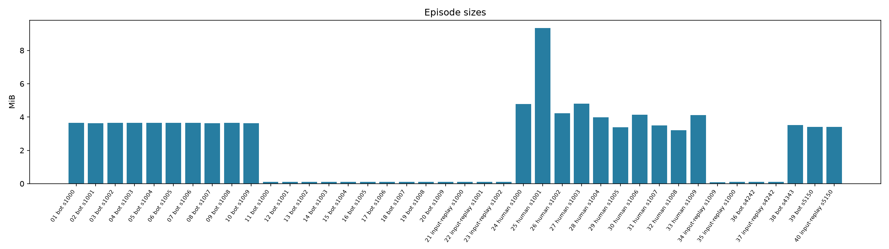
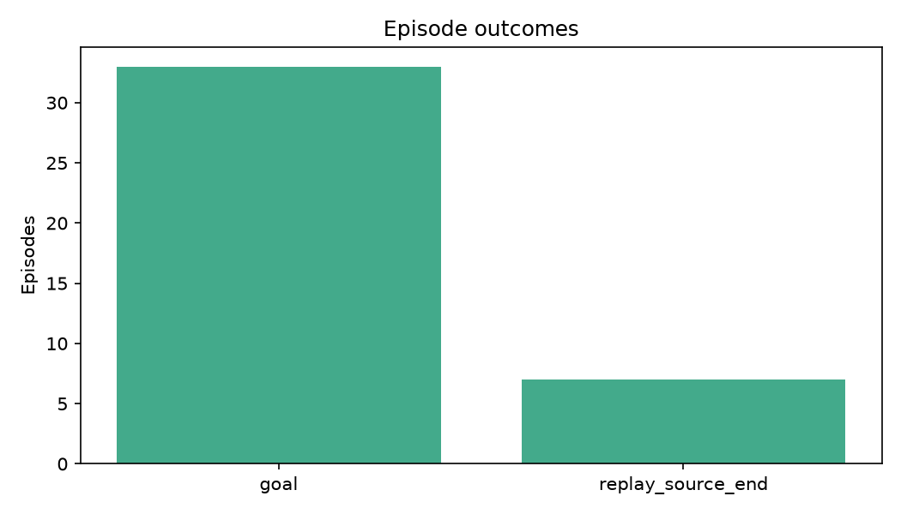
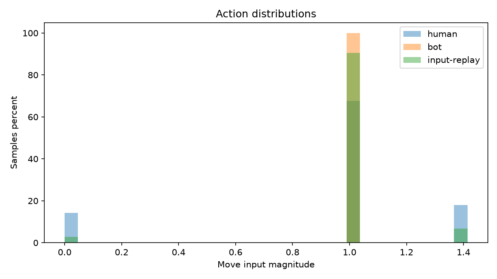
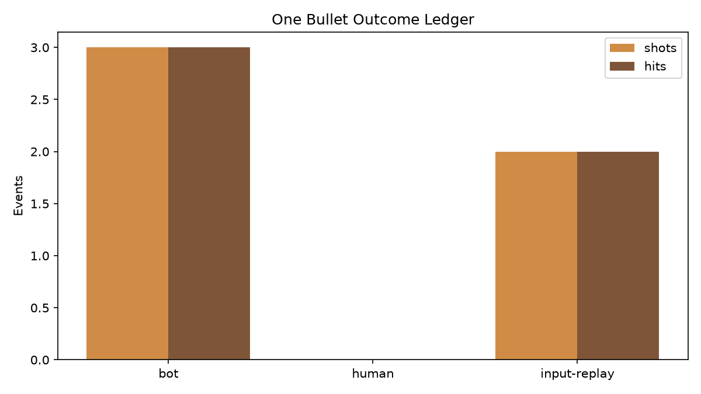
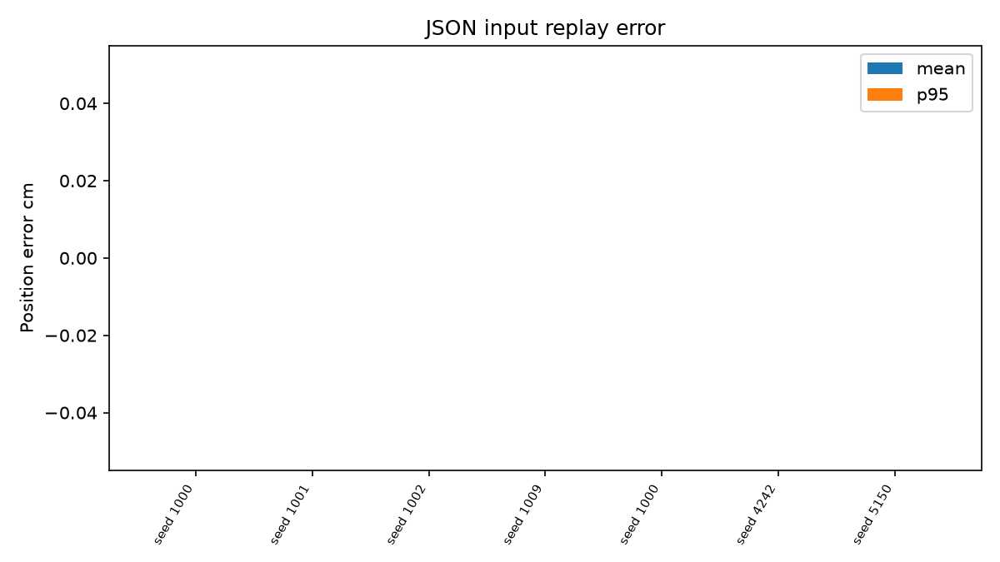
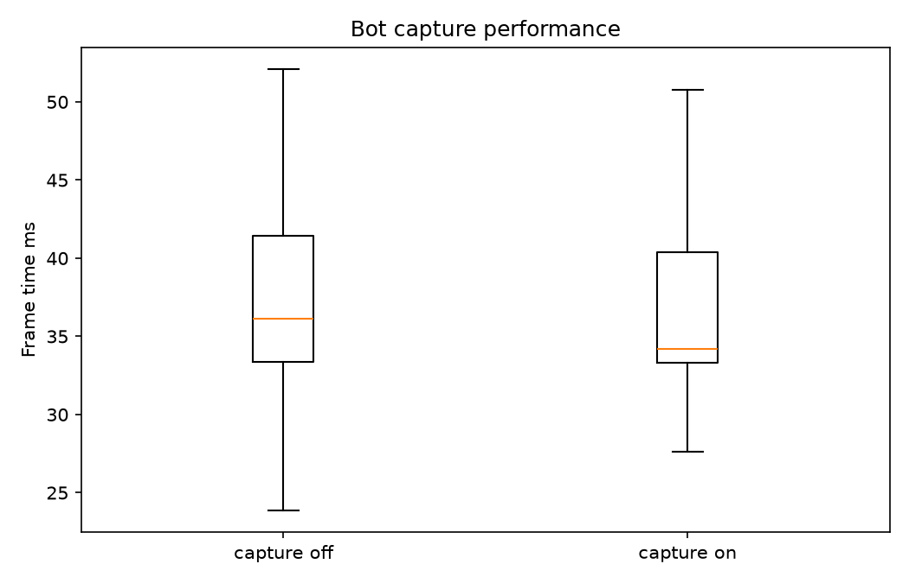

# Unreal SimTrace dataset report

- Episodes: 40
- Valid episodes: 40
- Validation errors: 0
- Missing capture frames: 0
- Dropped captures: 0
- Total size: 94.11 MiB

## Episodes

| Episode | Mode | Seed | Frames | Captures | End | Errors |
|---|---:|---:|---:|---:|---|---:|
| episode_20260730T164634194Z_bot_s1000_00 | bot | 1000 | 165 | 55 | goal | 0 |
| episode_20260730T164641344Z_bot_s1001_01 | bot | 1001 | 165 | 55 | goal | 0 |
| episode_20260730T164648592Z_bot_s1002_02 | bot | 1002 | 165 | 55 | goal | 0 |
| episode_20260730T164655604Z_bot_s1003_03 | bot | 1003 | 165 | 55 | goal | 0 |
| episode_20260730T164702745Z_bot_s1004_04 | bot | 1004 | 165 | 55 | goal | 0 |
| episode_20260730T164709878Z_bot_s1005_05 | bot | 1005 | 165 | 55 | goal | 0 |
| episode_20260730T164716899Z_bot_s1006_06 | bot | 1006 | 165 | 55 | goal | 0 |
| episode_20260730T164723940Z_bot_s1007_07 | bot | 1007 | 165 | 55 | goal | 0 |
| episode_20260730T164731160Z_bot_s1008_08 | bot | 1008 | 165 | 55 | goal | 0 |
| episode_20260730T164738287Z_bot_s1009_09 | bot | 1009 | 165 | 55 | goal | 0 |
| episode_20260730T164830642Z_bot_s1000_00 | bot | 1000 | 165 | 0 | goal | 0 |
| episode_20260730T164837783Z_bot_s1001_01 | bot | 1001 | 165 | 0 | goal | 0 |
| episode_20260730T164844831Z_bot_s1002_02 | bot | 1002 | 165 | 0 | goal | 0 |
| episode_20260730T164851990Z_bot_s1003_03 | bot | 1003 | 165 | 0 | goal | 0 |
| episode_20260730T164859222Z_bot_s1004_04 | bot | 1004 | 165 | 0 | goal | 0 |
| episode_20260730T164906257Z_bot_s1005_05 | bot | 1005 | 165 | 0 | goal | 0 |
| episode_20260730T164913385Z_bot_s1006_06 | bot | 1006 | 165 | 0 | goal | 0 |
| episode_20260730T164920481Z_bot_s1007_07 | bot | 1007 | 165 | 0 | goal | 0 |
| episode_20260730T164927729Z_bot_s1008_08 | bot | 1008 | 165 | 0 | goal | 0 |
| episode_20260730T164935297Z_bot_s1009_09 | bot | 1009 | 165 | 0 | goal | 0 |
| episode_20260730T165021898Z_input-replay_s1000_00 | input-replay | 1000 | 165 | 0 | replay_source_end | 0 |
| episode_20260730T165047652Z_input-replay_s1001_00 | input-replay | 1001 | 165 | 0 | replay_source_end | 0 |
| episode_20260730T165115218Z_input-replay_s1002_00 | input-replay | 1002 | 165 | 0 | replay_source_end | 0 |
| episode_20260731T044221731Z_human_s1000_00 | human | 1000 | 179 | 60 | goal | 0 |
| episode_20260731T044336494Z_human_s1001_00 | human | 1001 | 382 | 128 | goal | 0 |
| episode_20260731T044350176Z_human_s1002_01 | human | 1002 | 159 | 53 | goal | 0 |
| episode_20260731T044356310Z_human_s1003_02 | human | 1003 | 192 | 64 | goal | 0 |
| episode_20260731T044403543Z_human_s1004_03 | human | 1004 | 165 | 55 | goal | 0 |
| episode_20260731T044409877Z_human_s1005_04 | human | 1005 | 148 | 50 | goal | 0 |
| episode_20260731T044415643Z_human_s1006_05 | human | 1006 | 160 | 54 | goal | 0 |
| episode_20260731T044421810Z_human_s1007_06 | human | 1007 | 150 | 50 | goal | 0 |
| episode_20260731T044427643Z_human_s1008_07 | human | 1008 | 148 | 50 | goal | 0 |
| episode_20260731T044433410Z_human_s1009_08 | human | 1009 | 170 | 57 | goal | 0 |
| episode_20260731T044715442Z_input-replay_s1009_00 | input-replay | 1009 | 170 | 0 | replay_source_end | 0 |
| episode_20260731T045446201Z_input-replay_s1000_00 | input-replay | 1000 | 179 | 0 | replay_source_end | 0 |
| episode_20260731T081828574Z_bot_s4242_00 | bot | 4242 | 165 | 0 | goal | 0 |
| episode_20260731T081916738Z_input-replay_s4242_00 | input-replay | 4242 | 165 | 0 | replay_source_end | 0 |
| episode_20260731T083425344Z_bot_s4343_00 | bot | 4343 | 165 | 55 | goal | 0 |
| episode_20260731T091927349Z_bot_s5150_00 | bot | 5150 | 165 | 55 | goal | 0 |
| episode_20260731T092009850Z_input-replay_s5150_00 | input-replay | 5150 | 165 | 55 | replay_source_end | 0 |

## Seed reproducibility

| Seed | Episodes | Course hash match |
|---:|---:|---|
| 1000 | 5 | pass |
| 1001 | 4 | pass |
| 1002 | 4 | pass |
| 1003 | 3 | pass |
| 1004 | 3 | pass |
| 1005 | 3 | pass |
| 1006 | 3 | pass |
| 1007 | 3 | pass |
| 1008 | 3 | pass |
| 1009 | 4 | pass |
| 4242 | 2 | pass |
| 4343 | 1 | pass |
| 5150 | 2 | pass |

## Action distributions

| Mode | Samples | Move mean | Move p95 | Look mean | Look p95 | Jump rate | Fire rate | Collision rate |
|---|---:|---:|---:|---:|---:|---:|---:|---:|
| bot | 3795 | 1.000 | 1.000 | 0.811 | 2.000 | 7.30% | 0.08% | 0.61% |
| human | 1853 | 0.932 | 1.414 | 0.171 | 0.995 | 2.00% | 0.00% | 1.30% |
| input-replay | 1174 | 1.001 | 1.414 | 0.658 | 2.000 | 6.47% | 0.17% | 0.94% |

## One Bullet Outcome Ledger

- Contract: `one_bullet_outcome_ledger_v1`
- Shots: 5
- Hits: 5
- Hit rate: 100.00%
- Exact replay event matches: 2/2

| Mode | Shots | Hits | Hit rate |
|---|---:|---:|---:|
| bot | 3 | 3 | 100.00% |
| human | 0 | 0 | 0.00% |
| input-replay | 2 | 2 | 100.00% |

## JSON replay comparisons

| Replay | Frames | Mean cm | P95 cm | Final cm | Combat | Target |
|---|---:|---:|---:|---:|---|---|
| episode_20260730T165021898Z_input-replay_s1000_00 | 165 | 0.000 | 0.000 | 0.000 | n/a | pass |
| episode_20260730T165047652Z_input-replay_s1001_00 | 165 | 0.000 | 0.000 | 0.000 | n/a | pass |
| episode_20260730T165115218Z_input-replay_s1002_00 | 165 | 0.000 | 0.000 | 0.000 | n/a | pass |
| episode_20260731T044715442Z_input-replay_s1009_00 | 170 | 0.000 | 0.000 | 0.000 | n/a | pass |
| episode_20260731T045446201Z_input-replay_s1000_00 | 179 | 0.000 | 0.000 | 0.000 | n/a | pass |
| episode_20260731T081916738Z_input-replay_s4242_00 | 165 | 0.000 | 0.000 | 0.000 | pass | pass |
| episode_20260731T092009850Z_input-replay_s5150_00 | 165 | 0.000 | 0.000 | 0.000 | pass | pass |

## Capture performance

| Metric | Capture off | Capture on |
|---|---:|---:|
| Samples | 1815 | 1980 |
| Mean frame time ms | 37.691 | 36.754 |
| Median frame time ms | 36.136 | 34.211 |
| P95 frame time ms | 45.979 | 45.061 |

Median FPS drop: -5.629%

## Plots

## Validation issues

- None
